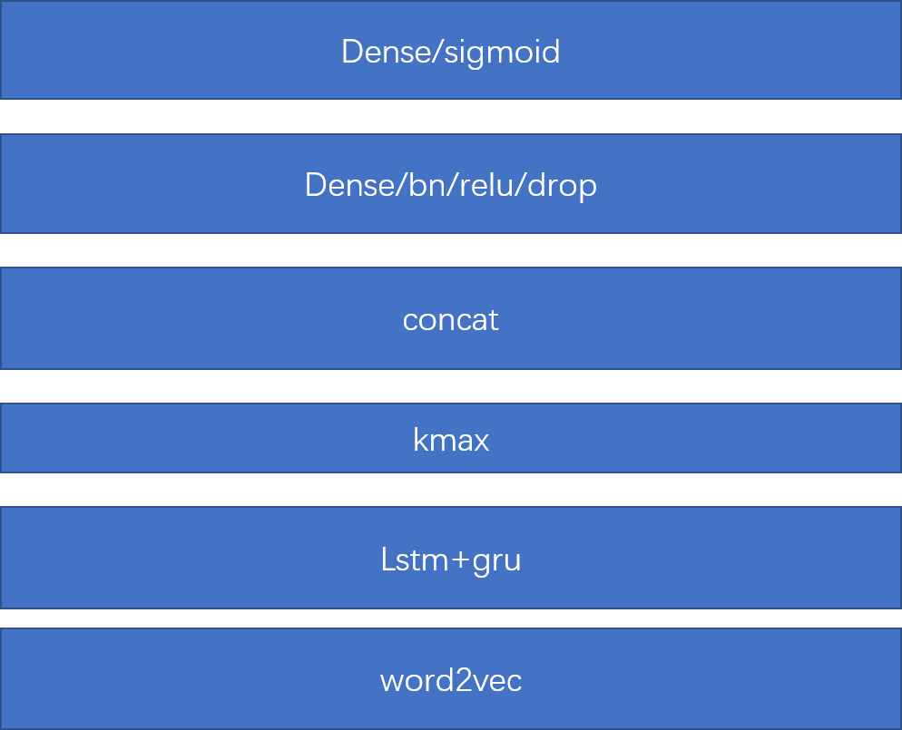
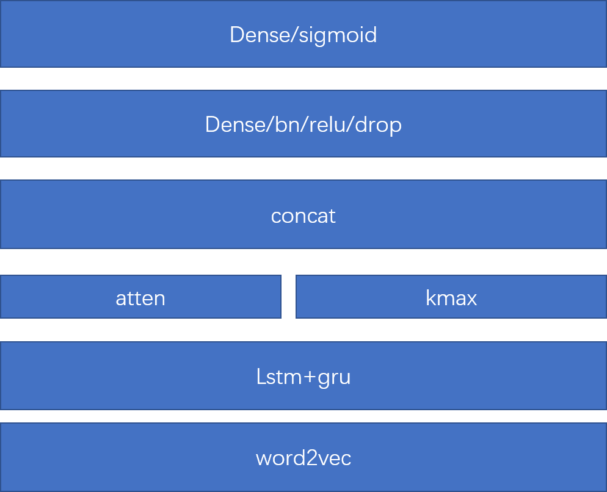
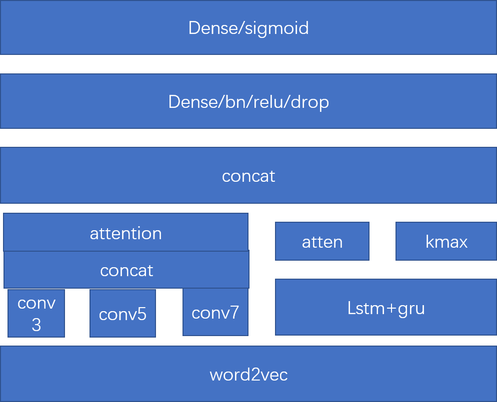
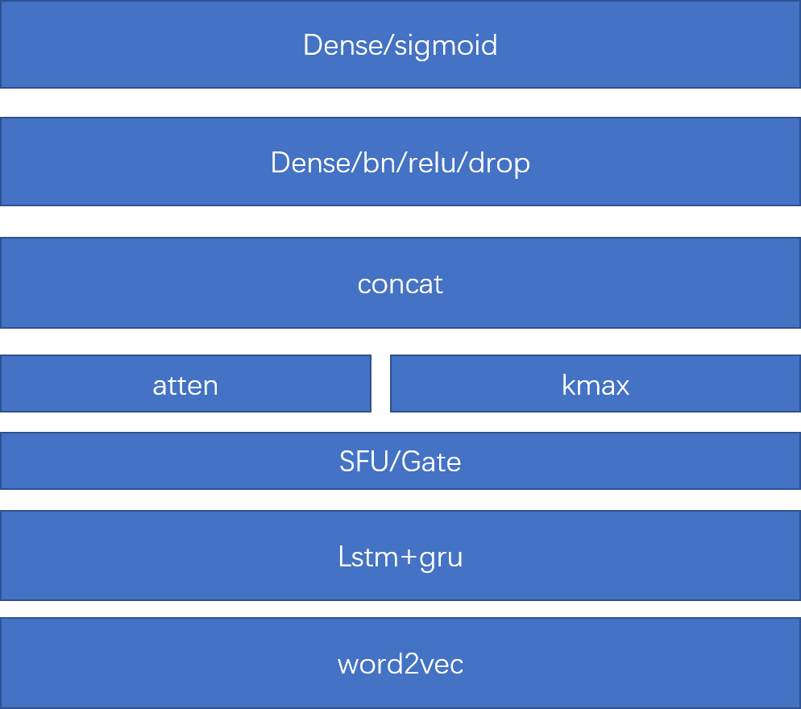

# quora
simple classifile(pytorch+keras)

**第一种模型**

**第二种模型**

**第三种模型**

kaggle quora-insincere-questions-classification 63th final model

.ipynb")

**第四种模型**

**第五种模型**

lstm+cap+pool

**第六种模型**

## 模型融合

简单blending
